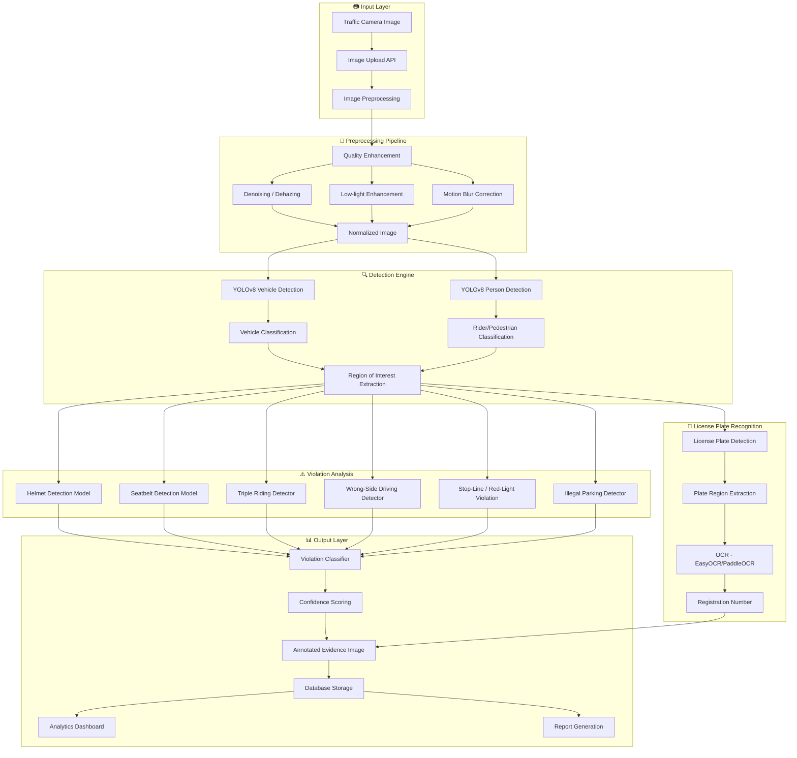

# 🚦 TrafficGuard AI — Flipkart Gridlock Hackathon 2.0 (Round 2)
## Automated Photo Identification & Classification for Traffic Violations

---

## 📋 Submission Checklist (from HackerEarth)

| # | Deliverable | Status | Notes |
|---|-------------|--------|-------|
| 1 | **Title** | `[ ]` | "TrafficGuard AI — Automated Traffic Violation Detection & Classification" |
| 2 | **Description** | `[ ]` | Detailed project write-up (we'll draft this) |
| 3 | **Theme** | `[ ]` | Select from dropdown (Computer Vision / AI) |
| 4 | **Snapshots** | `[ ]` | 3-5 screenshots of the dashboard + detection results |
| 5 | **Video URL** | `[ ]` | 2-3 min demo video (upload to YouTube/Loom) |
| 6 | **Presentation** | `[ ]` | 10-12 slide pitch deck (.pdf/.pptx) |
| 7 | **Demo Link** | `[ ]` | Deployed web app (Vercel + Railway/Render) |
| 8 | **Repository URL** | `[ ]` | GitHub repo with clean README |
| 9 | **Source Code** | `[ ]` | .zip of the repo (max 50MB) |
| 10 | **Instructions to Run** | `[ ]` | Step-by-step setup guide |
| 11 | **Custom Attachment** | `[ ]` | Optional: model weights, sample data |

---

## 🏗️ System Architecture



---

## 🛠️ Recommended Tech Stack

| Layer | Technology | Why |
|-------|-----------|-----|
| **Object Detection** | YOLOv8 (Ultralytics) | State-of-art, fast, easy fine-tuning, hackathon-friendly |
| **Image Preprocessing** | OpenCV + albumentations | Industry standard, rich preprocessing toolkit |
| **OCR (License Plates)** | EasyOCR or PaddleOCR | Works well on Indian plates, multi-language support |
| **Backend API** | FastAPI (Python) | Async, fast, auto-generates Swagger docs (impressive for judges) |
| **Frontend Dashboard** | React + Vite | Fast dev, modern UI, great for analytics visualizations |
| **Charts/Analytics** | Recharts or Chart.js | Easy to integrate, beautiful charts |
| **Database** | SQLite (dev) / PostgreSQL (prod) | Lightweight for hackathon, scales for demo |
| **Deployment** | Vercel (frontend) + Railway/Render (backend) | Free tier, easy deploy |
| **Model Serving** | ONNX Runtime or direct PyTorch | Fast inference, no GPU needed for demo |

---

## 📅 Phased Workflow (Execution Order)

> [!IMPORTANT]
> The phases below are ordered by **dependency and impact**. Follow this exact sequence for maximum efficiency. Time estimates assume 1-2 person team working intensively.

---

### Phase 1: Foundation & Setup (Day 1 — ~4 hours)

**Goal**: Get the project skeleton up and running.

#### Tasks:
1. **Repository Setup**
   - Create GitHub repo with proper structure
   - Add `.gitignore`, `README.md`, `LICENSE`
   - Set up virtual environment (`python -m venv venv`)

2. **Project Structure**
   ```
   trafficguard-ai/
   ├── backend/
   │   ├── app/
   │   │   ├── main.py              # FastAPI entry point
   │   │   ├── routes/
   │   │   │   ├── upload.py         # Image upload endpoint
   │   │   │   ├── violations.py     # Violation query endpoints
   │   │   │   └── analytics.py      # Stats & reporting
   │   │   ├── models/
   │   │   │   ├── detector.py       # YOLO detection wrapper
   │   │   │   ├── violation.py      # Violation classification logic
   │   │   │   ├── ocr.py            # License plate OCR
   │   │   │   └── preprocessor.py   # Image preprocessing pipeline
   │   │   ├── database/
   │   │   │   ├── models.py         # SQLAlchemy models
   │   │   │   └── db.py             # DB connection
   │   │   ├── utils/
   │   │   │   ├── annotator.py      # Draw bounding boxes + labels
   │   │   │   └── evidence.py       # Evidence image generation
   │   │   └── config.py
   │   ├── weights/                   # Pre-trained model weights
   │   ├── requirements.txt
   │   └── Dockerfile
   ├── frontend/
   │   ├── src/
   │   │   ├── components/
   │   │   │   ├── Dashboard.jsx
   │   │   │   ├── UploadPanel.jsx
   │   │   │   ├── ViolationCard.jsx
   │   │   │   ├── AnalyticsCharts.jsx
   │   │   │   └── EvidenceViewer.jsx
   │   │   ├── pages/
   │   │   ├── App.jsx
   │   │   └── main.jsx
   │   ├── package.json
   │   └── vite.config.js
   ├── data/
   │   ├── sample_images/            # Test images
   │   └── annotations/             # Ground truth (if any)
   ├── notebooks/
   │   └── exploration.ipynb         # Model experiments
   ├── docs/
   │   └── architecture.png
   └── README.md
   ```

3. **Install Core Dependencies**
   ```bash
   # Backend
   pip install fastapi uvicorn ultralytics opencv-python-headless easyocr \
               sqlalchemy pillow python-multipart albumentations

   # Frontend
   npm create vite@latest frontend -- --template react
   cd frontend && npm install recharts axios react-router-dom lucide-react
   ```

4. **Download Pre-trained Models**
   - YOLOv8n or YOLOv8s from Ultralytics (for speed in demo)
   - EasyOCR models (auto-download on first use)

---

### Phase 2: Image Preprocessing Pipeline (Day 1-2 — ~3 hours)

**Goal**: Build a robust preprocessing module that handles real-world image challenges.

#### Tasks:
1. **`preprocessor.py`** — Core preprocessing functions:
   - **Auto-enhancement**: CLAHE (Contrast Limited Adaptive Histogram Equalization) for low-light
   - **Denoising**: OpenCV's `fastNlMeansDenoisingColored`
   - **Dehazing**: Dark channel prior or simple contrast stretch
   - **Motion blur detection**: Laplacian variance check → apply Wiener filter if blurry
   - **Normalization**: Resize to standard input size (640×640 for YOLO), normalize pixel values

2. **Quality Assessment Score**: Output a 0-100 image quality score to display in UI

> [!TIP]
> Don't over-engineer preprocessing. YOLO is robust to moderate noise. Focus on CLAHE + resize + normalize as the minimum viable pipeline. Add dehazing/deblurring as polish.

---

### Phase 3: Vehicle & Person Detection (Day 2 — ~4 hours)

**Goal**: Detect and classify all road users from a traffic image.

#### Tasks:
1. **`detector.py`** — YOLO Detection Wrapper:
   - Load YOLOv8 pretrained on COCO (has car, truck, bus, motorcycle, bicycle, person classes)
   - Run inference → extract bounding boxes, class labels, confidence scores
   - Filter by confidence threshold (≥ 0.4)
   - Apply NMS (Non-Maximum Suppression) — built into YOLO

2. **Vehicle Classification**:
   - Map COCO classes → custom categories:
     - `car` → Sedan/Hatchback
     - `truck` → Heavy Vehicle
     - `bus` → Public Transport
     - `motorcycle` → Two-Wheeler
     - `bicycle` → Bicycle
   - Count occupants per vehicle (person boxes overlapping with vehicle boxes)

3. **Output Format**:
   ```json
   {
     "detections": [
       {
         "id": 1,
         "class": "motorcycle",
         "category": "Two-Wheeler",
         "bbox": [x1, y1, x2, y2],
         "confidence": 0.92,
         "occupants": 2
       }
     ]
   }
   ```

---

### Phase 4: Violation Detection Models (Day 2-3 — ~8 hours) ⭐ CORE

**Goal**: This is the heart of the project. Detect specific traffic violations.

> [!IMPORTANT]
> This is the most critical phase. Spend the most time here. The quality of violation detection directly determines your hackathon score.

#### 4A. Helmet Non-Compliance Detection
- **Approach**: For each detected motorcycle rider, check if a helmet is present
- **Method 1 (Quick)**: Fine-tune YOLOv8 on a helmet/no-helmet dataset
  - Datasets: [Safety Helmet Detection on Kaggle](https://www.kaggle.com/datasets/andrewmvd/hard-hat-detection), or motorcycle helmet datasets
- **Method 2 (Faster for hackathon)**: Use a pre-trained helmet detection YOLO model from Roboflow Universe
- **Logic**: If `person` on `motorcycle` AND no `helmet` detected in head region → **VIOLATION**

#### 4B. Seatbelt Non-Compliance
- **Approach**: For occupants in cars, check seatbelt presence
- **Method**: Crop the driver/passenger region → run a binary classifier (seatbelt/no-seatbelt)
- **Alternative**: Use a pre-trained model from Roboflow or fine-tune a small CNN (ResNet18)

#### 4C. Triple Riding Detection
- **Approach**: Count persons associated with a single motorcycle
- **Logic**: If motorcycle has ≥ 3 `person` detections overlapping → **VIOLATION**
- **Implementation**: IoU (Intersection over Union) between person boxes and motorcycle box

#### 4D. Wrong-Side Driving
- **Approach**: Detect vehicle direction relative to road lane markings
- **Method**: 
  1. Detect lane markings (Hough Line Transform or a lane detection model)
  2. Determine expected traffic direction from road geometry
  3. Check if vehicle heading contradicts expected direction
- **Simplified**: Define ROI zones in the image; vehicles detected in the wrong zone = violation

#### 4E. Stop-Line / Red-Light Violation
- **Approach**: 
  1. Detect traffic signals (red/green/yellow) using color detection or a small classifier
  2. Detect stop line position (edge detection or predefined zone)
  3. If signal is RED and vehicle bbox crosses the stop line → **VIOLATION**

#### 4F. Illegal Parking
- **Approach**: 
  1. Define no-parking zones (configurable regions in the image)
  2. If a vehicle is detected stationary in a no-parking zone → **VIOLATION**
  3. For static images: vehicle in no-parking zone = violation

#### Violation Classification Output:
```json
{
  "violations": [
    {
      "type": "HELMET_NON_COMPLIANCE",
      "severity": "HIGH",
      "confidence": 0.87,
      "vehicle_id": 1,
      "description": "Motorcycle rider without helmet detected",
      "bbox": [x1, y1, x2, y2]
    }
  ]
}
```

---

### Phase 5: License Plate Recognition (Day 3 — ~4 hours)

**Goal**: Detect license plates and extract text via OCR.

#### Tasks:
1. **Plate Detection**:
   - Use YOLOv8 fine-tuned on Indian license plate dataset (available on Roboflow/Kaggle)
   - Or use a pre-trained WPOD-NET / ALPR model
   - Crop the detected plate region

2. **Plate Preprocessing**:
   - Grayscale conversion
   - Perspective correction (deskew)
   - Binarization (Otsu's threshold)
   - Resize to standard dimensions

3. **OCR Extraction**:
   ```python
   import easyocr
   reader = easyocr.Reader(['en'])
   result = reader.readtext(plate_image)
   # Post-process: regex for Indian plate format
   # e.g., "MH 12 AB 1234" or "DL 01 CA 0001"
   ```

4. **Indian Plate Format Validation**:
   - Regex: `^[A-Z]{2}\s?\d{1,2}\s?[A-Z]{1,3}\s?\d{4}$`
   - Common OCR corrections (0↔O, 1↔I, 5↔S, 8↔B)

---

### Phase 6: Evidence Generation & Storage (Day 3-4 — ~3 hours)

**Goal**: Produce annotated images and store violation records.

#### Tasks:
1. **`annotator.py`** — Draw on images:
   - Bounding boxes with color-coded labels (red for violations, green for compliant)
   - Violation type labels with confidence %
   - License plate text overlay
   - Timestamp and location watermark

2. **`evidence.py`** — Generate evidence package:
   - Annotated image (saved as JPEG)
   - Violation metadata JSON
   - Timestamp
   - Unique violation ID

3. **Database Models** (SQLAlchemy):
   ```python
   class Violation(Base):
       id = Column(Integer, primary_key=True)
       image_path = Column(String)
       annotated_image_path = Column(String)
       violation_type = Column(String)  # ENUM
       confidence = Column(Float)
       vehicle_type = Column(String)
       license_plate = Column(String)
       timestamp = Column(DateTime)
       location = Column(String)
       severity = Column(String)
       status = Column(String)  # "pending", "confirmed", "dismissed"
   ```

---

### Phase 7: Backend API (Day 4 — ~4 hours)

**Goal**: RESTful API that ties everything together.

#### API Endpoints:
| Method | Endpoint | Description |
|--------|----------|-------------|
| `POST` | `/api/upload` | Upload image for analysis |
| `GET` | `/api/violations` | List all violations (with filters) |
| `GET` | `/api/violations/{id}` | Get violation details |
| `GET` | `/api/analytics/summary` | Violation statistics |
| `GET` | `/api/analytics/trends` | Time-based trends |
| `GET` | `/api/analytics/by-type` | Violations grouped by type |
| `GET` | `/api/evidence/{id}` | Get annotated evidence image |
| `POST` | `/api/batch-upload` | Process multiple images |

#### Processing Flow:
```python
@app.post("/api/upload")
async def analyze_image(file: UploadFile):
    # 1. Save uploaded image
    # 2. Preprocess
    # 3. Run vehicle/person detection
    # 4. Run violation detection
    # 5. Run license plate OCR
    # 6. Generate annotated evidence
    # 7. Store in database
    # 8. Return results
```

---

### Phase 8: Frontend Dashboard (Day 4-5 — ~6 hours) ⭐ HIGH IMPACT

**Goal**: A stunning, modern dashboard that wows the judges.

> [!IMPORTANT]
> The dashboard is what judges SEE FIRST. Make it visually impressive. Dark theme, smooth animations, glassmorphism, gradient accents.

#### Pages & Components:

1. **Dashboard Home** (`/`)
   - Real-time violation counter cards (with animated numbers)
   - Violation type distribution (donut chart)
   - Trend line chart (violations over time)
   - Recent violations feed (live-updating cards)
   - Severity heatmap

2. **Upload & Analyze** (`/analyze`)
   - Drag-and-drop image upload zone
   - Real-time processing animation (skeleton loader → results)
   - Side-by-side: Original image ↔ Annotated image
   - Detected violations list with confidence bars
   - License plate extracted text
   - Export evidence button

3. **Violation Records** (`/violations`)
   - Searchable, filterable table
   - Filter by: type, date, severity, vehicle type, plate number
   - Click to expand → full evidence view
   - Bulk export (CSV/PDF)

4. **Analytics** (`/analytics`)
   - Interactive charts (violations by type, by time, by location)
   - Top offenders (by license plate)
   - Model performance metrics (accuracy, precision, recall display)
   - Processing speed metrics

#### Design System:
- **Colors**: Dark navy (`#0f172a`) background, electric blue (`#3b82f6`) accents, violation red (`#ef4444`), success green (`#22c55e`)
- **Typography**: Inter (Google Fonts)
- **Effects**: Glassmorphism cards, gradient borders, subtle hover animations
- **Icons**: Lucide React

---

### Phase 9: Integration & Testing (Day 5 — ~4 hours)

**Goal**: Wire everything together and test end-to-end.

#### Tasks:
1. Connect frontend ↔ backend API
2. Test with sample traffic images (collect 20-30 from Google / Kaggle)
3. Fix edge cases (no violations found, blurry image, no plate detected)
4. Performance benchmarking:
   - Measure inference time per image
   - Calculate mAP, precision, recall on test set
   - Document results in a metrics table

#### Performance Metrics to Report:
| Metric | Target | How to Calculate |
|--------|--------|-----------------|
| Accuracy | > 85% | Correct predictions / Total |
| Precision | > 80% | TP / (TP + FP) |
| Recall | > 75% | TP / (TP + FN) |
| F1-Score | > 78% | 2 × (P × R) / (P + R) |
| mAP@0.5 | > 70% | YOLO's built-in eval |
| Inference Time | < 2s/image | Time per image on CPU |

---

### Phase 10: Deployment (Day 5-6 — ~3 hours)

**Goal**: Get a live demo URL.

#### Deployment Strategy:
1. **Frontend** → Vercel (free, auto-deploy from GitHub)
2. **Backend** → Railway or Render (free tier, supports Python)
3. **Model Weights** → Bundle with backend (< 50MB for YOLOv8n) or use cloud storage
4. **Database** → SQLite file (bundled) or Railway PostgreSQL

#### Steps:
```bash
# Frontend
cd frontend && npm run build
# Deploy to Vercel via CLI or GitHub integration

# Backend
# Create Dockerfile
# Deploy to Railway: railway up
```

---

### Phase 11: Presentation & Documentation (Day 6 — ~4 hours)

**Goal**: Create a compelling pitch deck and demo video.

#### Pitch Deck (10-12 slides):
| Slide | Content |
|-------|---------|
| 1 | Title + Team + Tagline |
| 2 | Problem Statement (with statistics) |
| 3 | Solution Overview (architecture diagram) |
| 4 | Tech Stack |
| 5 | Key Features (with screenshots) |
| 6 | Live Demo Screenshots |
| 7 | Violation Detection Examples (before/after) |
| 8 | Analytics & Reporting |
| 9 | Performance Metrics (accuracy table) |
| 10 | Scalability & Future Scope |
| 11 | Business Impact |
| 12 | Thank You + Contact |

#### Demo Video (2-3 mins):
1. Quick problem statement (15 sec)
2. Upload an image → show real-time detection (45 sec)
3. Walk through annotated results (30 sec)
4. Show license plate OCR (15 sec)
5. Dashboard analytics (30 sec)
6. Architecture overview (15 sec)

#### README.md Must Include:
- Project title + badges
- Architecture diagram
- Features list
- Screenshots
- Tech stack
- Setup instructions (copy-paste ready)
- API documentation
- Performance metrics
- Future scope

---

## 🎯 Winning Strategy — What Judges Look For

> [!TIP]
> Based on typical hackathon judging criteria, prioritize these:

| Priority | Aspect | Weight | Our Approach |
|----------|--------|--------|-------------|
| 🥇 | **Innovation & Uniqueness** | HIGH | Multi-violation detection in single image, real-time confidence scoring, evidence chain |
| 🥇 | **Working Prototype** | HIGH | Live deployed demo with real detections |
| 🥈 | **Technical Depth** | MEDIUM-HIGH | YOLO + OCR + preprocessing pipeline, proper ML evaluation metrics |
| 🥈 | **UI/UX Quality** | MEDIUM-HIGH | Premium dark-theme dashboard with animations |
| 🥉 | **Scalability** | MEDIUM | Containerized, async processing, batch upload |
| 🥉 | **Presentation** | MEDIUM | Clear pitch deck + demo video |

---

## 🔑 Differentiators (What Makes Us Stand Out)

1. **Multi-Violation Detection in Single Image**: Most solutions detect one violation type. Ours detects ALL types simultaneously.
2. **Indian License Plate Specialized OCR**: Custom regex + corrections for Indian plate formats.
3. **Confidence-Scored Evidence Chain**: Every detection has a confidence score → legally defensible evidence.
4. **Adaptive Preprocessing**: Auto-detects image quality issues and applies appropriate corrections.
5. **Real-time Analytics Dashboard**: Not just detection, but actionable insights and trends.
6. **Batch Processing**: Upload multiple images for bulk analysis.

---

## ⚠️ Open Questions for You

> [!IMPORTANT]
> Please clarify these before we start building:

1. **Team Size**: You mentioned "1 member" — are you working solo or will more people join? This affects the scope we should target.

2. **Timeline**: When is the submission deadline for Round 2? This determines how much we can build.

3. **GPU Access**: Do you have access to any GPU (Google Colab, Kaggle, personal GPU)? This affects whether we fine-tune models or use only pre-trained ones.

4. **Deployment Preference**: Do you want to deploy on Vercel + Railway (free), or do you have other hosting in mind?

5. **Scope Priority**: Given time constraints, which violations should we prioritize? My recommendation:
   - **Must Have**: Helmet detection, Triple riding, License plate OCR
   - **Should Have**: Red-light violation, Stop-line violation, Wrong-side driving
   - **Nice to Have**: Seatbelt detection, Illegal parking

6. **Do you want me to start building the code now**, or do you want to refine the plan first?

---

## 📊 Effort Estimation Summary

| Phase | Hours | Priority |
|-------|-------|----------|
| Foundation & Setup | 4h | 🔴 Critical |
| Image Preprocessing | 3h | 🟡 Important |
| Vehicle Detection | 4h | 🔴 Critical |
| Violation Detection | 8h | 🔴 Critical |
| License Plate OCR | 4h | 🔴 Critical |
| Evidence Generation | 3h | 🟡 Important |
| Backend API | 4h | 🔴 Critical |
| Frontend Dashboard | 6h | 🔴 Critical |
| Integration & Testing | 4h | 🟡 Important |
| Deployment | 3h | 🟡 Important |
| Presentation & Docs | 4h | 🔴 Critical |
| **Total** | **~47h** | — |

> For a solo developer working intensively, this is achievable in **5-6 days** with focused effort.
